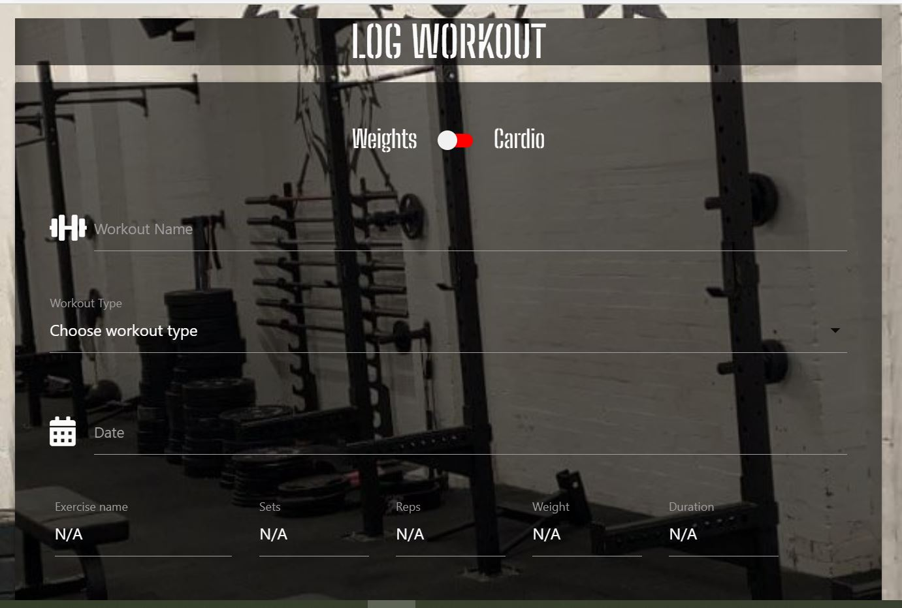

<h1 style="text-align: center">The Barbell Planner</h1>

This is my submission for Milestone project 3. The Barbell Planner is a fitness based application allowing the user
to log either a cardio or weights based workout. The user will be able to authenticate themself, log a workout, and then Read, Update or Delete
that workout from the list they have created. The application will also allow them to navigate to the Barbell gym site
and Social Media channels.

Live project: [https://barbell-planner.herokuapp.com/]

### User Experience (UX) ###

* User Story 1 - As a user, I land on the dashboard and it is clear what the site is and it's purpose.
* User Story 2  - As a user, I can easily navigate through the dashboard.
* User Story 3 - As a user, there is a clear call to action to login/Register.
* User Story 4 - As a user, given I havn't registered, there is a clear option for me to register as a user of the planner.
* User Story 5 - As a user I can access the business social media channels from anywhere on the site.
* User Story 6 - As an admin, I can limit the the navigation options presented to the user if they have not yet logged in.
* User Story 7 - As a new user, I can navigate to the registration page easily
* User Story 8 - As a user, There is a clear call to action on what details I must input into the registration fields
* User Story 9 - As a user, I can see if I have successfully registered
* User Story 10 - As a user, I am informed if I have entered invalid data into a field
* User Story 11 - As an admin, I can see the successfully registered username and encoded password in the database
* User Story 12 - As a user, given I have logged in, I can see a navigation bar giving me clear options that are not present to me when i'm logged out
* User Story 13 - As a user, I can see a clear call to action to log a workout when I have logged in
* User Story 14 - As a user, given I have logged in, I can logout at any point in the site
* User Story 15 - As a user, When I log a workout I have the choice to pick either a 'Cardio' Workout or a 'Weights' based workout
* User Story 16 - As a user when I select 'Weight' workout, I am asked for the name, reps and weight used in my workout and the date
* User Story 17 - As a user, When I select 'Cardio', I am asked for the exercise name, duration and date.
UPDATE - functionality changed for User stories 16 and 17, all above options are provided and are restricted when displayed in the
'Barbell Workouts' page.
* User Story 18 - As a user when I click on 'Log Workout' the workout then shows on the 'My Workout section of the site.
UPDATE - logged workouts are stored in 'Barbell workouts' section.
* User Story 19 - As a user, When I navigate to the My Workouts section, I can see the workouts that I have logged.
UPDATE - logged workouts are stored in 'Barbell workouts' section.
* User Story - 20 - As a User, I can Read, Update and Delete the work out I have created.

### Design ###

* Colour scheme - The colour scheme is black and white matching the brand and ethos of the business.

* Typography - the 'Big Shoulders Stencil Text' font is used as it is bold, easy to read and suits the military old school
feel of the brand.

* Imagery - The Barbell Gym logo is shown throughout the site to draw attention as the business' distinctive feature. Background images include images
from the gym and classes to provide an insight to users of what the gym looks like, can be seen throughout various pages of the site.

* WireFrames:
Desktop and Mobile wireframes - https://marvelapp.com/prototype/5d24b2d

* Features:
Responsive layout on mobile and tablet,
Collapsible Nav bar for mobile view,
Collapsible menu for displaying logged workouts,
Authentication (Login/Register functionality),
Search,
Defensive programming

### Technologies: ###

* Languages - 
HTML5
CSS3
JS
Python

* Frameworks/libraries/programs - 
  https://favicon.io/favicon-converter/ - Used to create logo for title.

  https://fonts.google.com/ - used for font design.

  Flask App - https://flask.palletsprojects.com/en/2.0.x/ to run site on and use of Jinja templating and Werkzeug functionality. 

  MongoDB Atlas - https://www.mongodb.com/ for the storage and retrieval of non-relational data. 

  Materialize CSS - https://materializecss.com/ Used for responsiveness and design of site,
  used to implement responsive header, footer and collapsible menu.

  Heroku - https://www.heroku.com/ cloud based platform used to deploy the Barbell planner.

  Free formatter - https://www.freeformatter.com/css-beautifier.html used to beautify CSS3 code.

  W3C markup Validator - https://validator.w3.org/ to check HTML formatting.

  JS Hint - https://jshint.com/ - to test JQuery formatting.

  

<h2 style="text-align: center">Testing</h2>

The W3C Markup Validator, W3C CSS and JSHint Validator Services were used to validate the project pages to ensure
there were no syntax errors.

* [W3C Markup validator](https://validator.w3.org/#validate_by_input)
1 Error - "The select element cannot have more than one selected option descendant unless the multiple attribute is specified."
Select element is required in order to pull through the selected data from when a workout is initially logged.

* [W3C CSS validator](https://jigsaw.w3.org/css-validator/validator) No errors were returned from the CSS validator.

* [JSHint](https://jshint.com/) No errors were returned from the JS validator.

### Testing user stories ###

* User Story 1 - As a user, I land on the dashboard and it is clear what the site is and it's purpose:
There is a clear page title under a clear navigation bar providing different navigation options at this stage on the site.
This is followed clear instructions prompting the user to either register or login to progress.
* User Story 2  - As a user, I can easily navigate through the dashboard:
The Nav bar is clearly presented at the top of the screen, and the menu collapses into a burger menu on smaller screen sizes
to improve usability and appearance.
* User Story 3 - As a user, there is a clear call to action to login/Register:
Options to either register or login are provided on a carousel to direct each user to their chosen page.

* User Story 4 - As a user, given I havn't registered, there is a clear option for me to register as a user of the planner:
Given I am on the site and have been directed to the login page, there is a clear prompt for me to register if I have not done so already.
Given I am on the site and have been directed to the registration page, there is a clear prompt for me to login if I have already registered.

* User Story 5 - As a user I can access the business social media channels from anywhere on the site:
The footer is constantly displayed with links to all the relevant social media channels, regardless if the user is logged in or not.
* User Story 6 and 12 - As an admin, I can limit the the navigation options presented to the user if they have not yet logged in.
Given I am a logged out user, the navigation options open to me are 'Home', 'Login' or 'Register'.
Given I am a logged in user, the navigation options change to 'Home', 'Barbell Workouts', 'Log a Workout' or 'Logout'
and the content of the homepage changes.

* User Story 7 - As a new user, I can navigate to the registration page easily:
Given I am logged out, I can easily navigate to the registration page, either the nav bar or the homepage.
* User Story 8 - As a user, There is a clear call to action on what details I must input into the registration fields:
There is a clear prompt to provide a username and password.
* User Story 9 - As a user, I can see if I have successfully registered
Given I have submitted the appropriate details, i am provided with a success message if I have successfully registered.
* User Story 10 - As a user, I am informed if I have entered invalid data into a field:
If I have entered wrong information into the registration fields, I am shown an error message.

* User Story 11 - As an admin, I can see the successfully registered username and encoded password in the database:
As and admin I can see the submitted information in MongoDB under collection 'Users' with username and a hashed password.
The password hash method is used through Werkzeug.

* User Story 13 - As a user, I can see a clear call to action to log a workout when I have logged in:
Once logged in I can access the 'Log a workout' page by clicking on the carousel or on the nav bar.

* User Story 14 - As a user, given I have logged in, I can logout at any point in the site:
Once logged in, the option to log out is available in the nav bar at any point in the customer journey.

* User Story 15 - As a user, When I log a workout I have the choice to pick either a 'Cardio' Workout or a 'Weights' based workout:
When logging a workout, I can see a switch that will let me indicate whether the workout is a 'cardio' or 'Weights' workout.

* User Story 16 & 17 (UPDATED) - When I log my workout, I can clearly see which type of workout it is, either 'Cardio' or 'Weights':
Given I have logged a workout, my workout will appear in the list in the 'Barbell workouts' page. I can clearly see which workouts are mine
and when I click on my workouts I am presented with an icon/tooltip that let's me know the type of workout it is.
* User Story 18- UPDATED - As a user when I click on 'Log Workout' the workout then shows on the 'Barbell workouts' section of the site,
and I am presnted with an success message:
When I have successfully logged a workout, I am directed back to the Barbell workouts page and presented with a success message. 
* User Story 19 - As a user, When I navigate to the My Workouts section, I can see the workouts that I have logged:
My workouts are clearly identified with an icon and I can only edit, or delete workouts I have logged.

* User Story - 20 - As a User, I can Read, Update and Delete the work out I have created:
Given I have logged a workout, I can edit that workout by clicking on 'Edit'. This takes me to the
Edit workout page.

Once I have made relevant changes to my workout, I can either click on 'Cancel' to go back without
submitting my changes, or 'Edit' to submit my changes. I then see a message to see I have successfully
edited my workout.

If I attempt to edit a workout that isn't mine, Iam presented with an error.

I can then search for my workout, by name or date, access my workout, or I can delete my workout.
Once I have clicked on delete, I am presnted with another message if deleted successfully.

### Further testing ###
     

* Bugs:
     The navigation header does not render correctly on Iphone 5/MotoG4 screen:
     Resolved: No, Iphone 5 and MotoG4 are old models and the navigation renders correctly on all phone/tablet models in
     the last 5 years.

* Potential enhancements:
    i. At the log workout stage, there could be some Javascript added so when either 'Cardio' or 'Weight'
    option is selected, the input fields change.
    ii. Additional defensive programming prompting user for confirmation when entering a new password,
    or deleting a workout.
    iii. The option to duplicate the excercises in the log/edit workout pages so users can use multiple excercises. 

<h2 style="text-align: center">Deployment</h2>

### GitHub Pages ###
The project was deployed to GitHub Pages using the following steps...

#### Log in to GitHub and locate the GitHub Repository ####

* At the top of the repository section, locate the "Settings" Button on the menu.
* Scroll down the settings page until you find the "GitHub Pages" section.
* You will see a message "Pages settings now has its own dedicated tab! Check it out here!" click on the link.
* Under "Source", click the dropdown and select "Master Branch".The page will refresh.
* The now published site link in the "GitHub Pages" section will be found at the top of the page.

### Forking the GitHub Repository ###
By forking the GitHub Repository we make a copy of the original repository on our GitHub account to view and/or make changes without affecting the original repository by using the following steps...

#### Log in to GitHub and locate the GitHub Repository ####

* At the top of the repository section just above the "Settings" button on the menu, click the "Fork" button.
  The original repository in your GitHub account should now have duplicated.

#### Making a Local Clone ####

* Log in to GitHub and locate the GitHub repository, under the repository name, click "clone or download".
* To clone the repository using HTTPS, under "Clone with HTTPS", copy the link.
* Open Git Bash
* Change the current working directory to the location where you want the cloned directory to be made.
* Type git clone, and then paste the URL you copied in Step 2.
   * $ git clone https://github.com/YOUR-USERNAME/YOUR-REPOSITORY
* Press Enter. Your local clone will be created.
   * $ git clone https://github.com/YOUR-USERNAME/YOUR-REPOSITORY
> Cloning into `CI-Clone`...
> remote: Counting objects: 10, done.
> remote: Compressing objects: 100% (8/8), done.
> remove: Total 10 (delta 1), reused 10 (delta 1)
> Unpacking objects: 100% (10/10), done.

<h2 style="text-align: center">Credits</h2>

### Code ###

w3Schools.com to help with some of the syntax of the Js.

Email.js for the contact us email functionality.

### Content ###

All typed content was written by the developer.

### Media ###

#### Image credits ####

### Acknowledgements ###
Thanks to Aaron my mentor, for advice on my project and the Code Institute Slack community.